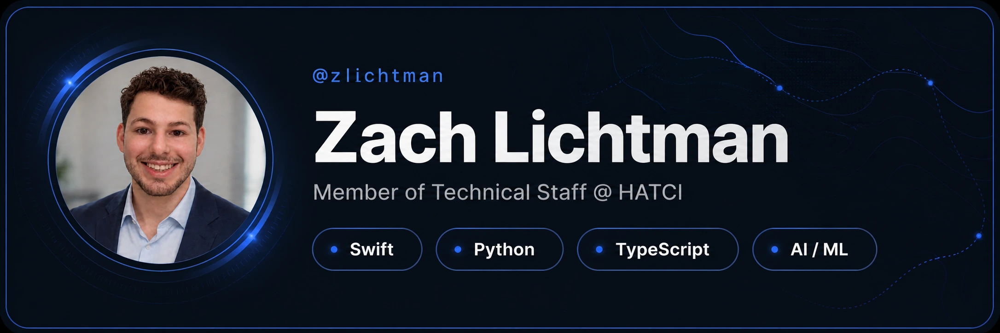
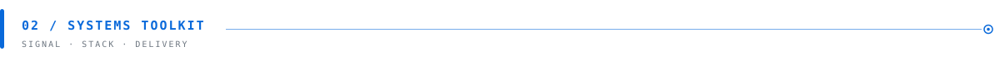

 

Infotainment DevOps &amp; production software · Madison, Wisconsin

  

&nbsp;
&nbsp;
&nbsp;

 

<table>
  <tr>
    <td width="33%" valign="top">
      <code>01 / NOW</code>  
      <strong>Automotive AI</strong> 
      Evaluation systems and production tooling for in-vehicle voice software.
    </td>
    <td width="34%" valign="top">
      <code>02 / FOCUS</code>  
      <strong>Beyond the screen</strong> 
      Embodied AI, robotics, trustworthy systems, and software that meets the physical world.
    </td>
    <td width="33%" valign="top">
      <code>03 / BUILD MODE</code>  
      <strong>Research → system → ship</strong> 
      Turning ambitious ideas into observable, maintainable tools people can actually use.
    </td>
  </tr>
</table>

 

<table>
  <tr>
    <td width="50%" valign="top">
      <code>LANGUAGES</code>  
      <code>Swift</code> · <code>Python</code> · <code>C/C++</code> · <code>Rust</code> · <code>Java</code> · <code>TypeScript</code>
    </td>
    <td width="50%" valign="top">
      <code>AI / ML</code>  
      <code>PyTorch</code> · <code>MONAI</code> · <code>Hugging Face</code> · <code>Claude SDK</code> · <code>Codex SDK</code>
    </td>
  </tr>
  <tr>
    <td width="50%" valign="top">
      <code>SYSTEMS</code>  
      <code>macOS</code> · <code>Linux</code> · <code>Yocto</code> · <code>Docker</code> · <code>Kubernetes</code> · <code>OpenShift</code>
    </td>
    <td width="50%" valign="top">
      <code>PRODUCT</code>  
      <code>SwiftUI</code> · <code>AppKit</code> · <code>React</code> · <code>Next.js</code> · <code>Mapbox</code> · <code>Supabase</code>
    </td>
  </tr>
  <tr>
    <td width="50%" valign="top">
      <code>DELIVERY</code>  
      <code>Tekton</code> · <code>Argo CD</code> · <code>GitLab</code> · <code>Ansible</code> · <code>AWS</code>
    </td>
    <td width="50%" valign="top">
      <code>SECURITY</code>  
      <code>Kali</code> · <code>Burp Suite</code> · <code>Web Exploitation</code> · <code>Auth0</code>
    </td>
  </tr>
</table>

 

  <code>EMBODIED AI</code> &nbsp;·&nbsp; <code>APPLIED SYSTEMS</code> &nbsp;·&nbsp; <code>TRUSTWORTHY SOFTWARE</code>

